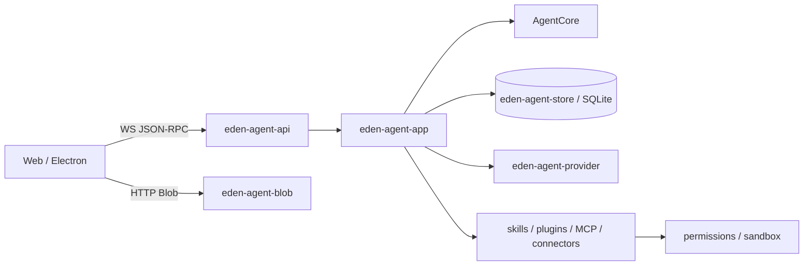

<div align="center">

# Eden Agent Rust Server

**The local backend, persistence layer, and extension host for Eden Agent**

[](https://github.com/jiang357357357/EdenAgent/actions/workflows/ci.yml)


[简体中文](README.md) · **English** · [Main repository](https://github.com/jiang357357357/EdenAgent)

</div>

## Overview

`eden-agent-server` is the only local backend process used by Eden Agent. It links the host-independent `AgentCore` Rust crates directly and exposes capability-token-protected WebSocket JSON-RPC and Blob HTTP endpoints.

The Server owns process boundaries and external side effects:

- SQLite persistence for events, sessions, jobs, and extension state
- SQLite-backed GSV TTS/STT configuration, hot updates, discovery, and previews
- OpenAI-compatible model providers and streaming responses
- Permission approval, capability tokens, and OS sandboxing
- Workspace, Blob, skills, plugins, MCP, and multi-agent orchestration
- Installable connectors and external worker lifecycles
- Mon business tools and desktop-runtime coordination

## Runtime path



Events are persisted before they are broadcast to clients. The Rust types in `eden-agent-api` and the generated TypeScript client are the single source of truth for the frontend protocol.

## Development

Run from the complete Eden Agent workspace:

```bash
git clone --recurse-submodules https://github.com/jiang357357357/EdenAgent.git
cd EdenAgent
cargo run -p eden-agent-server
```

Or use the project script:

```bash
npm run dev:server
```

The default listener is `127.0.0.1:40092`. Health check:

```bash
curl http://127.0.0.1:40092/readyz
```

## Configuration

For desktop use, local model configuration is normally managed through **Configuration → Model Service**. The Server also accepts environment variables:

| Variable | Purpose |
| --- | --- |
| `EDEN_AGENT_MODEL=provider/model` | Select a model, for example `openai/gpt-4o-mini` |
| `<PROVIDER>_API_KEY` | Provider credential, with `OPENAI_API_KEY` as a fallback |
| `EDEN_AGENT_BASE_URL` / `OPENAI_BASE_URL` | OpenAI-compatible API endpoint |
| `EDEN_AGENT_DATABASE` | SQLite database path |
| `EDEN_AGENT_BLOB_ROOT` | Blob storage directory |
| `EDEN_AGENT_WORKSPACE_ROOT` | Default workspace root |
| `EDEN_AGENT_CAPABILITY_TOKEN` | Client capability token; always synchronized to a `0600` token file |
| `MON_CORE_BASE_URL` / `MON_CORE_TOKEN` | Enable Mon business tools |
| `EDEN_AGENT_SANDBOX_EXECUTABLE` | Select an external command sandbox |

Never commit real credentials to source files, example configuration, test fixtures, or runtime logs.

**Configuration → Voice Configuration** writes GSV TTS/STT settings to Server SQLite over JSON-RPC. Changes apply to the next synthesis request or transcription connection without restarting the Server. Legacy `EDEN_AGENT_TTS_*` and `EDEN_AGENT_STT_*` variables are used only for a one-time compatibility import when the database has no voice configuration. Device-specific microphone, speaker, and playback-volume settings remain client-local.

## Protocol

- `/rpc`: WebSocket JSON-RPC
- `/blobs`: Blob upload and retrieval
- `/readyz`: service health check

Voice configuration RPC methods include `voice.config.read`, `voice.tts.config.update`, `voice.stt.config.update`, `voice.gsv.discover`, `voice.gsv.preview`, and `voice.stt.test`. Preview audio is returned through the Blob endpoint instead of inline Base64 in an RPC message.

There is no legacy REST/SSE compatibility layer. Regenerate the client after changing `eden-agent-api` types:

```bash
npm run generate:rpc
```

## Security boundary

- The service binds to the loopback interface by default.
- File writes, command execution, external communication, connector actions, skill changes, and job scheduling go through permission policy.
- Command tools are registered only when an OS sandbox is available; otherwise they fail closed.
- `AgentCore` does not depend on HTTP, SQLite, a model provider, Electron, or Mon Core.
- Process launch, networking, and persistence are centralized in the Server.

## Verification

Run from the complete workspace root:

```bash
cargo fmt --all --check
cargo clippy --workspace --all-targets --locked -- -D warnings
cargo test --workspace --locked
```

## Further reading

- [Multi-agent orchestration](docs/orchestration.md)
- [Subagents](docs/subagents.md)
- [Long-term all-Rust server architecture](https://github.com/jiang357357357/EdenAgent/blob/main/文档/技术/Eden Agent%20全%20Rust%20服务端长期架构方案.md) (Chinese)
- [Frontend and Electron-Core responsibilities](https://github.com/jiang357357357/EdenAgent/blob/main/文档/技术/Eden Agent%20前端与%20Electron-Core%20职责边界说明.md) (Chinese)
- [Installable connector protocol and package format](https://github.com/jiang357357357/EdenAgent/blob/main/文档/技术/Eden Agent%20可安装连接器协议与包格式.md) (Chinese)

## License

Current versions are source-available for noncommercial use under the [PolyForm Noncommercial License 1.0.0](LICENSE). Commercial use requires a [separate written commercial license](COMMERCIAL-LICENSE.md). Third-party dependencies, connector content, game assets, models, data, and trademarks are not automatically included in either licensing path.
