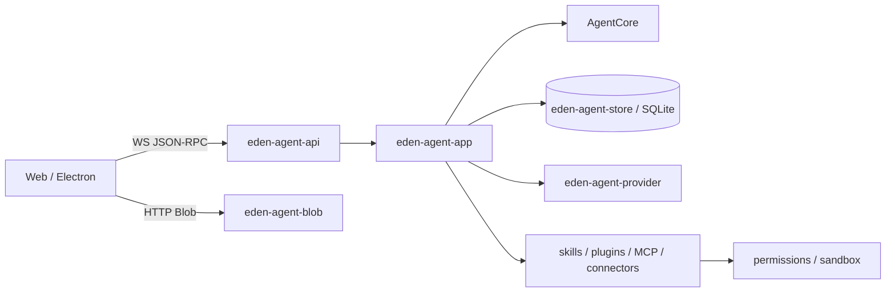

<div align="center">

# Eden Agent Rust Server

**Eden Agent 的本地后端、持久化与扩展宿主**

[](https://github.com/jiang357357357/EdenAgent/actions/workflows/ci.yml)


**简体中文** · [English](README.en.md) · [主仓库](https://github.com/jiang357357357/EdenAgent)

</div>

## 简介

`eden-agent-server` 是 Eden Agent 唯一的本地后端进程。它直接链接宿主无关的 `AgentCore` Rust crates，并对外提供带能力令牌的 WebSocket JSON-RPC 与 Blob HTTP 端点。

Server 负责所有进程边界和外部副作用：

- SQLite 事件、会话、作业和扩展状态持久化
- SQLite GSV TTS/STT 配置、热更新、目录发现与试听音频
- OpenAI 兼容模型供应商与流式响应
- 权限审批、能力令牌和操作系统沙箱
- 工作区、Blob、技能、插件、MCP 与多智能体
- 可安装连接器及外部 worker 生命周期
- Mon 业务工具和桌面运行时协调

## 运行链路



事件先写入持久化层，再广播给客户端。前端协议以 `eden-agent-api` 的 Rust 类型和生成的 TypeScript 客户端为唯一事实来源。

## 开发运行

推荐从完整 Eden Agent 工作区运行：

```bash
git clone --recurse-submodules https://github.com/jiang357357357/EdenAgent.git
cd EdenAgent
cargo run -p eden-agent-server
```

也可以使用项目脚本：

```bash
npm run dev:server
```

默认监听 `127.0.0.1:40092`。健康检查：

```bash
curl http://127.0.0.1:40092/readyz
```

## 配置

桌面模式推荐通过 **配置 → 模型服务** 管理本地模型配置。服务端也支持环境变量：

| 变量 | 用途 |
| --- | --- |
| `EDEN_AGENT_MODEL=provider/model` | 选择模型，例如 `openai/gpt-4o-mini` |
| `<PROVIDER>_API_KEY` | 对应供应商密钥；可回退到 `OPENAI_API_KEY` |
| `EDEN_AGENT_BASE_URL` / `OPENAI_BASE_URL` | OpenAI 兼容 API 地址 |
| `EDEN_AGENT_DATABASE` | SQLite 数据库路径 |
| `EDEN_AGENT_BLOB_ROOT` | Blob 存储目录 |
| `EDEN_AGENT_WORKSPACE_ROOT` | 默认工作区根目录 |
| `EDEN_AGENT_CAPABILITY_TOKEN` | 客户端能力令牌；始终同步到权限为 `0600` 的令牌文件 |
| `MON_CORE_BASE_URL` / `MON_CORE_TOKEN` | 启用 Mon 业务工具 |
| `EDEN_AGENT_SANDBOX_EXECUTABLE` | 指定外部命令隔离器 |

不要把真实密钥提交到仓库、示例配置、测试夹具或运行日志。

GSV TTS/STT 配置由 **配置 → 语音配置** 通过 JSON-RPC 写入 Server SQLite，并在下一次合成或转录连接时立即生效，无需重启。旧版 `EDEN_AGENT_TTS_*`、`EDEN_AGENT_STT_*` 环境变量仅在数据库尚无语音配置时执行一次兼容迁移；麦克风、扬声器和播放音量等设备设置仍保留在客户端。

## 协议

- `/rpc`：WebSocket JSON-RPC
- `/blobs`：Blob 上传与读取
- `/readyz`：服务健康检查

语音配置 RPC 包括 `voice.config.read`、`voice.tts.config.update`、`voice.stt.config.update`、`voice.gsv.discover`、`voice.gsv.preview` 与 `voice.stt.test`。试听音频通过 Blob 端点返回，不以内联 Base64 写入 RPC 消息。

本项目不提供旧 REST/SSE 兼容层。修改 `eden-agent-api` 类型后需重新生成客户端：

```bash
npm run generate:rpc
```

## 安全边界

- 默认只绑定回环地址。
- 写文件、执行命令、外部通信、连接器动作、技能变更和作业调度均经过权限策略。
- 命令工具只有在可用的操作系统沙箱中才注册；缺少沙箱时故障关闭。
- `AgentCore` 不依赖 HTTP、SQLite、具体供应商、Electron 或 Mon Core。
- 进程启动、网络访问和持久化由 Server 统一管理。

## 验证

从完整工作区根目录执行：

```bash
cargo fmt --all --check
cargo clippy --workspace --all-targets --locked -- -D warnings
cargo test --workspace --locked
```

## 延伸阅读

- [多智能体编排](docs/orchestration.md)
- [子智能体](docs/subagents.md)
- [全 Rust 服务端长期架构方案](https://github.com/jiang357357357/EdenAgent/blob/main/文档/技术/Eden Agent%20全%20Rust%20服务端长期架构方案.md)
- [前端与 Electron-Core 职责边界](https://github.com/jiang357357357/EdenAgent/blob/main/文档/技术/Eden Agent%20前端与%20Electron-Core%20职责边界说明.md)
- [可安装连接器协议与包格式](https://github.com/jiang357357357/EdenAgent/blob/main/文档/技术/Eden Agent%20可安装连接器协议与包格式.md)

## 许可证

当前版本依据 [PolyForm Noncommercial License 1.0.0](LICENSE) 提供非商业源码使用。商业使用需要[单独书面商业授权](COMMERCIAL-LICENSE.md)。第三方依赖、连接器内容、游戏素材、模型、数据和商标不自动包含在上述授权中。
